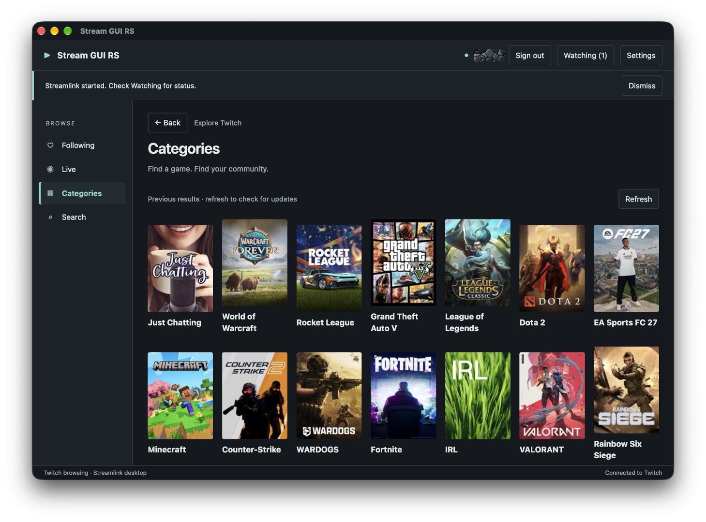

# Stream GUI RS

[](https://github.com/ChrisLauinger77/stream-gui-rs/actions/workflows/ci.yml)
[](<>)
[](<>)
[](LICENSE)


Stream GUI RS is a native desktop application for browsing Twitch and watching live streams through [Streamlink](https://streamlink.github.io/). It uses a compact Tauri interface and launches video in a separately installed player. Twitch is currently the only supported streaming service.

This is an independent rewrite inspired by [Streamlink Twitch GUI](https://github.com/streamlink/streamlink-twitch-gui). It is not affiliated with Twitch or the original project.



## Features

- Twitch Device Code sign-in with credentials stored in Keychain, Credential Manager, or Secret Service
- Following, popular live streams, categories, search, channel details, and Twitch Teams
- Local channel/category bookmarks and hidden discovery lists
- Home, Back/Forward restoration, configurable local shortcuts, and safe navigation links
- Server-side language filtering for Live/category streams and exact Twitch-login lookup
- Streamlink 8.0+ discovery and external playback
- Streamlink default player, mpv, VLC, and custom executable modes
- Source, High, Medium, Low, and Audio quality policies
- Multiple simultaneous streams with Stop, Restart, Watching, and bounded diagnostics
- Persistent global playback settings and per-channel overrides, including opt-in low latency
- Twitch chat in the system browser or independently authenticated Chatterino
- Up to 16 reusable named player profiles, with optional quality and low-latency preferences
- Manual stable-release awareness from the official GitHub repository (no automatic updater)
- Default and eight bundled color themes, conditional Custom Theme, System/Light/Dark modes, 100/125/150% text size, and focused application shortcuts
- English, German, Spanish, and French interface languages, with a System setting and English fallback
- Opt-in followed-stream monitoring, desktop notifications, and per-channel notification preferences
- Tray/menu-bar controls, Pause/Resume, and optional close-to-background behavior
- About on every desktop platform and a previewable support report

See the [1.0.0 release notes](docs/release-notes-1.0.0.md) for changes and upgrade guidance, and the [0.5.0 release notes](docs/release-notes-0.5.0.md) for the previous version. Candidate builds are not published releases.

Stream GUI RS does not bundle Streamlink or a media player. It does not contain an embedded player or chat client. Background features are available in 0.2.0 and later; v0.1.0 packages retain their original close-to-exit behavior.

## Downloads and platform support

Published releases provide these native artifacts:

| Platform   | Architecture                 | Artifact                                                   | Status                                                                                |
| ---------- | ---------------------------- | ---------------------------------------------------------- | ------------------------------------------------------------------------------------- |
| Windows 11 | x86_64                       | NSIS installer and portable/Scoop ZIP                      | Installer and portable package published                                              |
| Linux      | x86_64                       | AppImage, Debian `amd64` package, and RPM `x86_64` package | AppImage and Debian package natively tested; RPM installation remains a release check |
| macOS      | Universal (arm64 and x86_64) | Disk image (`.dmg`) containing the universal app           | Natively tested on Apple Silicon; native Intel execution remains a release check      |

ARM Linux/Windows packages are not currently published. The macOS disk image contains both Apple Silicon and Intel executable slices, but each architecture still requires native exact-artifact validation; cross-compilation alone is not treated as runtime proof.

The Windows installer is not code-signed, so Windows may show a SmartScreen warning. The macOS app bundle is ad-hoc signed but has no Developer ID signature or notarization, and Gatekeeper may block its first launch. Verify every downloaded file against the accompanying SHA-256 checksum.

## Runtime requirements

All platforms need:

- [Streamlink 8.0 or newer](https://streamlink.github.io/install.html), either on the desktop application's `PATH` or selected by absolute path in Settings
- a player supported by Streamlink; mpv and VLC have built-in discovery, or you can select another executable
- network access to Twitch and a Twitch account for browsing and playback launch

Platform requirements:

- **Windows:** Windows 11 x86_64 and the Microsoft Edge WebView2 Runtime. Windows 11 normally includes WebView2. Streamlink must be a native `streamlink.exe`; batch wrappers are rejected.
- **macOS:** macOS 11.0 or newer on Apple Silicon or Intel, with the system WebKit view and Keychain available. GUI applications can have a smaller `PATH` than Terminal, so select Streamlink/player paths in Settings when discovery does not find them.
- **Linux:** an x86_64 desktop, a user D-Bus session, and an unlocked Secret Service provider such as GNOME Keyring or KWallet. The Debian and RPM packages declare their native WebKitGTK and GTK dependencies. The AppImage bundles its application-side GTK/WebKit libraries but intentionally uses the host GLib, Wayland/Mesa, D-Bus, and Secret Service integration.

Secure credential storage is mandatory. There is no plaintext fallback. A locked or unavailable native credential store produces an explicit error.

## Install and connect

1. Download the artifact for your platform and its checksum file from [GitHub Releases](https://github.com/ChrisLauinger77/stream-gui-rs/releases).
2. Verify the SHA-256 checksum, then install or open the package.
3. Install Streamlink and a player if they are not already present.
4. Launch Stream GUI RS and select **Connect to Twitch**.
5. Open the Twitch verification page, enter the displayed code, and approve `user:read:follows`.
6. Open **Settings → Streamlink** to test discovery, then choose and test the player settings.
7. Browse a live channel and select **Watch**. Use **Watching** to stop or restart sessions.

Scoop users can install the portable Windows build from the author's bucket:

```powershell
scoop bucket add ChrisLauinger77 https://github.com/ChrisLauinger77/scoop-bucket
scoop install ChrisLauinger77/stream-gui-rs
```

Homebrew users can install the universal macOS build from the author's tap:

```sh
brew tap ChrisLauinger77/cask
brew install --cask stream-gui-rs
```

The Windows release also includes `stream-gui-rs.json` for direct Scoop installation. The bucket and cask definitions update from published GitHub Release assets.

Official installed builds contain the project's public Twitch application ID. Users do not set environment variables, register an application, or provide a client secret.

## Playback and privacy details

Rust owns Twitch credentials, settings, native processes, and session state. OAuth tokens stay outside the web interface, settings, diagnostics, and Streamlink arguments. Twitch browsing uses a bounded cache and explicit pagination. Streamlink configuration files and sideloaded plugins are disabled for launches from this app.

Navigation, interface reload, and Twitch logout leave existing streams running so they remain controllable from **Watching**. By default, closing the main window stops owned Streamlink/player process trees. With background close enabled, closing keeps monitoring and playback running; explicit Quit always cleans up owned processes. A custom player that deliberately detaches itself is outside that cleanup boundary.

The High, Medium, and Low selections prefer 720p30, 540p30, and 360p30 respectively, with source fallback when Twitch does not offer a matching rendition. They are preferences rather than guaranteed resolution caps.

## Discovery, appearance, and support

**Live** and category streams offer **Stream language**: Any language, a curated language list, or Other. Twitch applies the filter on the server. Changing it starts that view from its first page and saves the default for later discovery visits. Back restores the language used by that earlier visit. Following, Search, and the background monitor keep their existing scope.

**Open channel** accepts an exact Twitch login (letters, numbers, underscores, up to 25 characters; case-insensitive). It opens the existing channel details, including offline channels. Enter a login, not a URL; lookup never starts playback. Search remains the discovery tool for partial names and categories.

**Settings → Playback → Prefer low latency** defaults off. Channel preferences can inherit, enable, or disable it. This adds Streamlink's `--twitch-low-latency` flag; actual delay depends on the stream, connection, buffering and player. Saving leaves current processes unchanged. Restart applies current preferences to that session.

**Settings → Appearance → Language** offers System, English, Deutsch, Español, and Français. System follows the operating system language for the supported languages and uses English otherwise; an OS language change is picked up on the next app launch. The selection saves immediately and persists across restarts. The separate **Stream language** filter controls Twitch discovery results, not interface text. UI translations ship in the app and require no download.

**Settings → Appearance → Text size** supports 100%, 125%, and 150%. Save applies the Rust-persisted value; it combines with desktop/webview scaling. Closing Settings or Watching returns focus to its opener when still appropriate. Playback announcements describe the Streamlink process, not verified video rendering.

**Settings → Appearance → Theme** offers Default, Catppuccin, Dracula, Everforest, Gruvbox, Nord, Rosé Pine, Solarized, and Tokyo Night. Default keeps the existing Stream GUI RS colors. **Color mode** retains System, Light, and Dark; System follows the desktop color preference. Dracula uses Dark only while selected and restores the previous mode when another theme is chosen. Save applies the choice and preserves it across restarts.

To add **Custom Theme**, copy [the example palette](docs/custom-theme.json) to `custom-theme.json` beside the app's `settings.json` in its configuration directory. A complete `dark` object with the example's twelve color keys is required, each using a six-digit hex value; an optional complete `light` object supplies separate light colors. Without `light`, the dark colors serve both modes. The option appears only while the file is valid. Changes to a selected custom palette apply within about a second, including while Settings is open. If the file becomes unavailable or invalid, Default is shown while the saved Custom selection remains; restoring a valid file restores Custom automatically. Use **Use Default** in Appearance to replace an unavailable Custom selection. The file supplies colors only, never CSS or executable content. Custom colors are accepted without automatic contrast correction, so check text and focus visibility on the chosen backgrounds.

**About Stream GUI RS** is available from the tray/status menu and the main interface. macOS keeps its native AppKit panel; Linux and Windows use one small main-window dialog. About restores a hidden main window, shows the icon, compiled version/commit, and a fixed GitHub repository link. Close/Escape closes the dialog; explicit application Quit still cleans up playback and monitoring.

**Settings → Prepare support report** shows selectable text for manual copying. Rust includes only build/platform metadata, a previously validated numeric Streamlink version (or “not checked”), player mode, and up to sixteen anonymous process phases/failure codes/exit codes. It excludes account/channel identities, credentials, paths, arguments, environment, raw logs and arbitrary error messages. Opening it performs no probe, credential access, upload, clipboard write, or Twitch request. Review the preview before sharing; the full local Developer tools diagnostics are a different, more detailed surface.

## Teams, bookmarks, navigation and shortcuts

**Search → Teams** opens an exact Twitch team name (the final name in its Twitch team address). Team metadata is displayed as text; members are sorted by login with duplicate IDs removed. Up to 300 members are shown, with an explicit limit notice for larger teams. Open a member to see current channel details and Watch. Team membership alone does not establish live/offline status.

Channel and category details offer **Bookmark** and **Hide from discovery**. **Bookmarks** is a local list, independent of Twitch follows and shared across this app's signed-in accounts. Each bookmark stores its stable Twitch ID, kind and a small saved label; labels can become outdated. Opening uses the normal channel/category view, with retained results labeled and an explicit Refresh action. Remove stale bookmarks from the list without resolving them first.

Hidden channels are excluded from **Live** and category stream listings. Hidden categories are excluded from **Categories** and their streams from **Live**. **Following, Search, Teams, bookmarks, exact lookup and direct links remain reachable**, including items that are both hidden and bookmarked. Opening a hidden category directly shows it, while still filtering hidden channels within it. **Settings → Hidden items** reviews and restores entries. Bookmarks and hidden items each allow 200 entries; all preferences still share the 256-KiB settings-file bound. These controls do not affect monitoring, notifications or running playback.

**Home** selects Following. **Back** and **Forward** retain up to twelve history entries, including search query/type, category language, scroll and meaningful focus. Retained results are labeled and do not trigger a request just for navigation; an evicted snapshot loads through Rust again. A new destination or edited search clears Forward history. Refresh remains explicit.

**Settings → Shortcuts** customizes Home, Following, Live, Categories, Search, Watching, Open channel, Bookmarks, Settings, Back, Forward and Refresh. The numbered defaults are Primary+1 through Primary+6 for Following, Live, Categories, Watching, Open channel and Bookmarks; Primary means Command on macOS and Ctrl elsewhere. Select Change, press the desired combination, and Save shortcuts. Escape cancels capture; Tab exits normally. Unassign disables an action; Reset restores a draft of the platform defaults. Conflicts (including Control/Command equivalence across platforms) and reserved/unsupported keys are shown before save. Shortcuts remain local to the focused app and pause during typing and modal dialogs. The OS may intercept its own shortcuts before the app receives them.

## Application links

Installed packages associate the `stream-gui-rs` scheme with these navigation-only forms:

```text
stream-gui-rs://show
stream-gui-rs://channel/example_login
stream-gui-rs://category/509658
stream-gui-rs://team/example-team
```

Channel logins allow 1–25 ASCII letters, digits or underscores. Category IDs are positive decimal IDs, at most 32 digits, with no leading zero. Team names allow 1–100 ASCII letters, digits, underscores or hyphens. Login/team case is normalized. Links are limited to 256 bytes. Query strings, fragments, percent encoding, Unicode identifiers, credentials, ports, extra segments and other actions are rejected. Links never start playback, change settings or execute commands.

An existing instance is shown and activated. On a cold start, the latest valid intent waits in Rust until settings and authentication restoration are ready; a browsing link received while signed out waits for sign-in. Repeated links replace the pending intent, and old acknowledgements cannot erase a newer one. Navigation already started under an old account is discarded on logout. Nothing is persisted as link history.

Protocol registration comes from installed packages. Bare development binaries and unintegrated AppImages/portable Windows copies do not automatically claim OS associations; Linux/Windows developers can pass one literal link as the executable's sole argument. macOS uses native LaunchServices activation of an installed app bundle; launching multiple bare binaries directly is outside that contract. Linux forwarding uses the user session bus. A separate CLI is deferred: the protocol handler provides navigation forwarding, not a scripting/result API.

## Profiles, external chat and update checks

In **Settings → Player → Profiles**, choose a configuration and press **Use profile**. Add, edit/rename or delete profiles there; names are unique and limited to 64 characters / 128 UTF-8 bytes, with at most 16 profiles. The separate Default configuration remains available. A profile contains the existing player mode, optional executable override and literal argument rows, plus optional quality and low latency. Select a profile in the management list to repair or delete it even if its executable has disappeared.

Effective playback uses **global defaults → selected profile → channel overrides → explicit launch quality**. A profile replaces the player configuration; omitted profile quality/low latency inherit global values. Channels keep their independent overrides, but do not select profiles. Editing, selecting or deleting a profile leaves running sessions unchanged; **Restart** resolves current preferences. Deleting the active profile selects Default configuration for future launches/restarts. Upgrading keeps existing player settings and starts with no profiles.

In **Settings → Playback → Chat application**, choose Browser (the default) or Chatterino. Chatterino must be installed separately and signed in independently; Stream GUI RS never transfers its Twitch credentials. Discovery checks PATH and common native installation locations, with an absolute executable override. macOS overrides point to the executable inside the app bundle. On Linux, automatic discovery also supports the official Chatterino Flatpak (`com.chatterino.chatterino`), checking the user installation before the default system installation when no native executable is found. Explicit executable overrides retain priority. Other Flatpak IDs, Snap wrappers and custom arguments are not supported.

The integration requests a channel-only Chatterino window. Upstream disables settings saving for this mode, so configure/sign in through Chatterino's normal launcher first. Each invocation may create another independent process/window; reuse is not guaranteed. These windows survive Stop and Quit and must be closed in Chatterino. At most 16 still-running direct Chatterino launches are retained by this app. A missing/failed Chatterino launch produces a clear error without stopping playback or silently opening another provider. Channel details always offer **Open chat in browser**. Automatic chat and per-channel inheritance continue to use the selected provider.

**Settings → Updates → Check for updates** contacts only this project's public GitHub latest-release endpoint. Checks are manual on every installation; there is no startup check, background polling, notification or stored update preference. Rust keeps results and failures for 24 hours during the current application run; **Refresh update check** bypasses that cache at most once per minute. A newer stable semantic version offers **View release**, opening the fixed official repository's release page. A newer development version is never offered an older stable version as an upgrade. Update failure cannot block authentication, browsing or playback. No installer is downloaded or executed automatically.

## Background monitoring and notifications

In **Settings → Background**, enable **Monitor followed live streams**, choose a 1, 2, or 5 minute interval, and enable notifications. Background preferences default off for new installations; upgrades from 0.2.0 preserve existing monitoring, notification and close behavior. Channel preferences can inherit, enable, or disable the global notification default. Monitoring still requires sign-in; notification permission is independent.

The first scan is quiet. Later newly observed Twitch stream IDs can notify with channel, title, and category. Pause stops polling until Resume or application restart. Resume, waking from sleep, and recovering from an outage establish a quiet baseline, without replaying missed transitions. Incomplete scans retain a marked previous count and retry with bounded backoff. Very large or slow scans can report incomplete monitoring; they never silently report a partial list as complete. At most ten eligible notifications are sent per scan; excess transitions are suppressed rather than queued into a later burst.

Notification clicks restore the app and select the channel while the original sign-in session remains valid; they do not start playback. **Watching** and **Quit** are available from the tray menu, and Quit is also in the main interface. Quit's label indicates active streams that it will stop.

**Keep Stream GUI RS running in the background when the window is closed** is opt-in. Normal minimize remains the OS minimize action. Background close hides the window when a tray is available, or minimizes it when there is no usable tray. Playback continues in both cases; restore the app to use Stop/Restart.

- **Linux:** notification delivery and click actions depend on the desktop notification server. The UI reports OS-managed delivery, not a permission grant. A StatusNotifier host and an Ayatana/AppIndicator library are needed for the tray; GNOME may need an indicator extension. A missing library/host falls back to minimize. Losing the host restores a hidden window.
- **Windows:** native toast notifications use the application's installed identity. After a banner times out, its Notification Center entry remains actionable for up to 15 minutes while the app and original monitoring/sign-in session remain active. Pause, logout and Quit retire those entries; notification clicks cannot reopen the app after Quit. Use the installer and its Start-menu shortcut for notification testing; an unregistered portable executable may not support delivery/activation. When this behavior changes, use the [native notification acceptance procedure](docs/notification-acceptance.md#windows-retained-notification-acceptance) and real followed-stream checks.
- **macOS:** allow notifications explicitly in Settings, then manage denial in macOS System Settings. Notifications require an installed, correctly signed app bundle; a bare development executable reports unavailable. Authorization failures remain visible and can be retried after correcting the installation. See the [notification acceptance guide](docs/notification-acceptance.md) if no permission prompt appears.

See the [testing policy](docs/testing.md) for native acceptance and exact-package smoke requirements.

## Current limitations

Stream GUI RS does not provide embedded video/chat, arbitrary chat applications, advanced Streamlink transports, an automatic updater, or legacy configuration import. Monitoring stops when the application is fully quit. Active sessions and logs are not persisted. See [architecture](docs/architecture.md) for the detailed contracts.

## Building from source

Build requirements are separate from the runtime requirements above:

- stable Rust 1.88 or newer
- Node.js 22.22.2+, 24.15.0+, or 26+ with npm; CI uses Node 24
- [Tauri 2 prerequisites](https://v2.tauri.app/start/prerequisites/) for the target platform
- on Debian/Ubuntu, `libayatana-appindicator3-dev` for tray support alongside the existing native prerequisites

Install locked frontend dependencies and start development with your own registered public Twitch client ID:

```sh
npm ci
TWITCH_CLIENT_ID=yourPublicClientId npm run tauri dev
```

Build a native release binary with an embedded public ID:

```sh
TWITCH_CLIENT_ID_BUILD=yourPublicClientId npm run tauri build -- --no-bundle --features custom-protocol
```

No client secret is used. The build fails if a distribution build has no valid embedded public ID. See [authentication](docs/authentication.md) for configuration precedence and PowerShell examples.

Builds embed a seven-character lowercase Git commit in About, backend diagnostics, and the safe support report. CI/release jobs set `STREAM_GUI_RS_COMMIT` to GitHub's exact checkout SHA (including the merge commit for pull-request checks). Local builds use Git HEAD at build time when available; source archives or invalid metadata show `unknown`. An explicit variable takes precedence over local Git and accepts 7–64 hexadecimal characters. No Git installation or source checkout is needed at runtime. Local uncommitted changes are not reflected by a dirty suffix; the identifier describes HEAD. Normal users need no configuration, and application versioning still uses the existing release metadata.

Run the project checks from the repository root:

```sh
npm run build
npm test
cargo fmt --manifest-path src-tauri/Cargo.toml --all -- --check
cargo test --locked --manifest-path src-tauri/Cargo.toml --no-default-features --features test-support
cargo check --locked --manifest-path src-tauri/Cargo.toml --all-targets --features test-support
cargo clippy --locked --manifest-path src-tauri/Cargo.toml --all-targets --features test-support -- -D warnings
TWITCH_CLIENT_ID_BUILD=ciCompileOnlyPublicClient123 npm run tauri build -- --debug --no-bundle --features custom-protocol --ci
git diff --check
```

The synthetic ID in the final command is only for local compilation checks and cannot authenticate. Official release artifacts use the registered public ID from GitHub Actions. Tests use synthetic credentials, a native fake Streamlink executable, and loopback HTTP fixtures; they do not access real Twitch credentials.

For native notification acceptance without a Twitch live transition, build with the opt-in `notification-acceptance` feature and open **Settings → Developer tools → Send test notification**. It is restricted to debug/test builds; normal builds omit the command and permission. See [notification acceptance setup and platform steps](docs/notification-acceptance.md), including installed debug packages for Windows and macOS.

## Reporting issues

[Open a GitHub issue](https://github.com/ChrisLauinger77/stream-gui-rs/issues) with reproduction steps and the previewed **Settings → Prepare support report** text. Add OS/player version details manually if useful; the report intentionally excludes identifying data and logs. Do not paste OAuth tokens, refresh tokens, device codes, credential-store exports, or other secrets.

Release maintainers should use the [release process](docs/releasing.md) and [testing policy](docs/testing.md). Earlier accepted feature behavior need not be retested in full for a metadata-only version bump; fresh CI and exact-package checks remain required.

## License and acknowledgements

Stream GUI RS is licensed under [GNU GPL version 3 only](LICENSE). It relies on open-source Rust and npm dependencies under their respective licenses. Playback is provided by the separately installed [Streamlink](https://streamlink.github.io/) project. No assets from Streamlink Twitch GUI are distributed here.

The bundled theme palette data and custom-theme example are adapted from [Sidra](https://github.com/wimpysworld/sidra) under the [Blue Oak Model License 1.0.0](https://blueoakcouncil.org/license/1.0.0). The palette colors trace to their upstream theme projects as noted in `src/styles/palettes.ts`.

Released milestones and deferred ideas are summarized in the [road to 1.0](docs/road-to-1.0.md).
